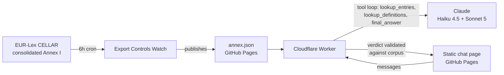

# EU Dual-Use Classifier

**Describe a technology → get a guided, cited triage against Annex I of Regulation (EU)
2021/821 — always in its latest consolidated version.**

An open-source, interview-style classification assistant for EU export controls. You describe
what you build; it asks you **one targeted technical question at a time** (wavelengths,
Adjusted Peak Performance, materials, accuracies…), pulls the exact control text, and
concludes with a verdict that **quotes the regulation verbatim, with dotted-path citations**
(`3B001.f.1.b.1 …`) — or tells you honestly that the item is not listed, or that you need a
human expert.

> ⚠️ **Not legal advice.** This is an indicative, automated triage. Catch-all controls
> (Articles 4 and 5 of the Regulation) may apply regardless of listing, national measures and
> the EU Common Military List are out of scope, and a licensing authority or qualified counsel
> has the final word.

## Why it's always up to date

The dataset is produced by [Export Controls Watch](https://rikiosso.github.io/exports-watch/),
an autonomous monitor that ingests the latest **consolidated** Annex I from EUR-Lex (CELLAR)
every 6 hours — including in-place corrigenda — and republishes it as
[`annex.json`](https://rikiosso.github.io/exports-watch/data/annex.json): 384 entries with
verbatim one-line-per-provision text, machine-flagged technical thresholds, the definitions
annex, general notes, and Articles 2/4/5. When the law changes, this classifier's ground truth
updates within hours, with no manual step.



## How a classification works

1. The model sees a cached prompt with the **index of all 384 entries** plus the general
   notes and Articles 2/4/5 — never its training memory of the regulation.
2. It narrows candidates and fetches **full verbatim entry text** through a read-only
   `lookup_entries` tool (definitions via `lookup_definitions`).
3. It interviews you — one discriminating technical question per turn, always quoting the
   threshold it is testing.
4. A cheap model (Haiku 4.5) runs the interview; the moment it decides the facts are
   sufficient, the **final verdict is written by a stronger model (Sonnet 5)** under a strict
   JSON schema.
5. **The server validates every verdict against the corpus before you see it**: every cited
   entry code must exist, and every "verbatim quote" must actually appear in the entry text.
   A verdict citing invented text is rejected by code — the assistant has to keep asking
   questions instead. No unverifiable classification ever ships.

## Cost design (why a public LLM demo doesn't bankrupt anyone)

This runs on a hard budget by construction, not by hope:

- per-visitor cap (2 AI conversations/day) — fairness;
- global caps — **$0.30/day and $10/month absolute**, enforced in the Worker (Workers KV)
  *and* as a spend limit on the dedicated API key;
- when the daily budget is spent, the page switches to **Browse mode** — a fully client-side
  search of the same Annex I dataset that costs nothing and never goes down.

Prompt caching keeps a full conversation at roughly $0.09.

## Run your own

```bash
cd worker
npm install
npm test                                  # 12 offline tests, no API key needed
npx wrangler kv namespace create BUDGET_KV   # paste the id into wrangler.toml
npx wrangler secret put ANTHROPIC_API_KEY
npx wrangler deploy
# then put your workers.dev URL into docs/config.js — GitHub Pages serves docs/ as-is
```

`docs/` is plain HTML/JS — GitHub Pages serves it as-is (Settings → Pages → main /docs). The Worker is the only backend, and
the only secret is your Anthropic API key (use a dedicated key with a monthly spend limit).

## Honesty guarantees, in code

- Verbatim-or-nothing: quotes are validated against the corpus server-side
  ([worker/src/loop.ts](worker/src/loop.ts), `validateVerdict`).
- Every verdict carries the `corpus_version` it was made against and the sha256 of the
  system prompt (provenance).
- The disclaimer is appended by the Worker, not the model — it cannot be talked out of it.
- Model text is rendered with `textContent`, never `innerHTML` — no markup injection.

## Legal

Annex I text © European Union, [EUR-Lex](https://eur-lex.europa.eu/) — reuse permitted with
acknowledgment (Commission Decision 2011/833/EU). Only the Official Journal of the European
Union is authentic. Code: MIT.

---

Built by [Ricardo Álvarez-Ossorio Castro](https://www.linkedin.com/) — export-controls and
tech lawyer. Part of a series: [Export Controls Watch](https://rikiosso.github.io/exports-watch/)
(autonomous monitoring) → this classifier (interactive triage).
