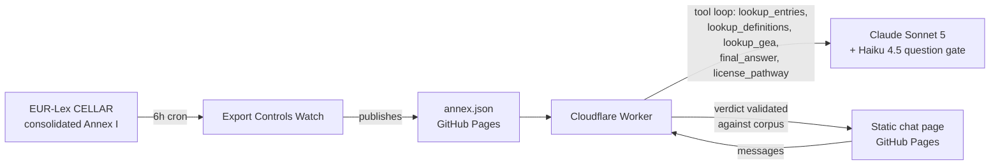

# EU Dual-Use Classifier

**Describe a technology and get it classified under Regulation (EU) 2021/821 — then see
which export authorisation applies. Every quote verbatim, checked against the cited
provision, always from the latest consolidated text.**

An open-source, interview-style classification assistant for EU export controls. You describe
what you build; it asks you **one targeted technical question at a time** (wavelengths,
Adjusted Peak Performance, materials, accuracies…), pulls the exact control text, and
concludes with a verdict whose every quote is **checked verbatim against the cited provision**, with dotted-path citations
(`3B001.f.1.b.1 …`) — or tells you honestly that the item is not listed, or that you need a
human expert.

> ⚠️ **Not legal advice.** This is an indicative, automated triage. Catch-all controls
> (Articles 4 and 5 of the Regulation) may apply regardless of listing, national measures and
> the EU Common Military List are out of scope, and a licensing authority or qualified counsel
> has the final word.

## Why it's always up to date

The dataset is produced by [Export Controls Watch](https://rikiosso.github.io/exports-watch/),
an autonomous monitor that ingests the latest **consolidated** Annex I from EUR-Lex (CELLAR)
every 6 hours — including in-place corrigenda — and republishes it as
[`annex.json`](https://rikiosso.github.io/exports-watch/data/annex.json): 384 entries with
verbatim one-line-per-provision text, machine-flagged technical thresholds, the definitions
annex, general notes, and Articles 2/4/5. When the law changes, this classifier's ground truth
updates within hours, with no manual step.


```mermaid
flowchart LR
    A[EUR-Lex CELLAR\nconsolidated Annex I] -->|6h cron| B[Export Controls Watch]
    B -->|publishes| C[annex.json\nGitHub Pages]
    C --> D[Cloudflare Worker]
    E[Static chat page\nGitHub Pages] -->|messages| D
    D -->|"tool loop: lookup_entries,\nlookup_definitions, lookup_gea,\nfinal_answer, license_pathway"| F[Claude Sonnet 5\n+ Haiku 4.5 question gate]
    D -->|verdict validated\nagainst corpus| E
```

## How a classification works

1. The model sees a cached prompt with the **index of all 384 entries** plus the general
   notes and Articles 2/4/5 — never its training memory of the regulation.
2. It narrows candidates and fetches **full verbatim entry text** through a read-only
   `lookup_entries` tool (definitions via `lookup_definitions`).
3. It interviews you — one discriminating technical question per turn, always quoting the
   threshold it is testing.
4. Claude Sonnet 5 runs the interview and writes the verdicts under a strict JSON schema.
   Every candidate question passes a **question gate** before it ships: deterministic
   detectors block questions that echo a value you already stated, offer alternatives that
   are the same number, or near-duplicate a question you already answered — and a cheap
   judge model vetoes anything else that is already answered or could not change the
   outcome. A blocked question becomes either a better question or a conclusion.
5. **The server validates every verdict against the corpus before you see it**: every cited
   entry code must exist, every dotted path must belong to its entry, and every "verbatim
   quote" must actually appear **in the specific provision named by that dotted path** — not
   merely somewhere in the multi-page entry, which blocks a threshold or comparator lifted from
   a neighbouring clause. Reasoning rows carry a `met` flag, so tested-and-ruled-out entries
   appear on the card without being headlined; where a Technical Note defines a term by
   formula (e.g. 'MRF'), the explanation must **show the calculation** and its result must
   agree with the claimed outcome; N.B./SEE ALSO cross-references on the cited provision must
   be engaged; a **not-listed** verdict must show the candidates it tested and ruled out; and
   conclusions can only ever reach you as validated cards — prose verdicts, raw tool syntax,
   empty replies and dead-air turns are all intercepted and escalated by code. A verdict that
   fails any check is rejected and corrected or the assistant asks instead. No unverifiable
   classification ever ships. (82 offline tests pin all of this.)
6. The response **streams live progress** — you watch it consult Annex I, read the cited
   entries and draft the card stage by stage, instead of staring at a spinner.

## Stage 2 — the licensing pathway

A classification is only half the journey. After a **Listed** verdict, the assistant keeps
going **in the same breath**: it asks for the destination and end-use (one continuous
interview — no separate stage to trigger), retrieves the **EU General Export
Authorisations** (EU001–EU008, Annex II of the same Regulation — also auto-updated by the
watcher) and determines the pathway: **GEA available** (conditions quoted verbatim),
**individual authorisation required** (quoting the provision that rules the GEAs out), or —
for destinations under an EU sanctions regime — **sanctions review required**, which the tool
flags loudly and refuses to resolve: sanctions law is out of scope by design, and the server
rejects any pathway that would green-light a sanctioned destination. Every pathway is an
ab initio draft determination that **requires review by qualified counsel** before reliance.
The licensing stage cannot run without a validated classification first, must sweep every
GEA whose item scope could reach the entry (EU008 for any Category 5 Part 2 item), must
quote conditions from the authorisation it grants, and renders into the **same card** as the
classification — one ask, one determination. Only need the classification? Say so
("just classify it — I don't need the licence") and the destination questions stop; the
classification card ships alone.

## Cost design (why a public LLM demo doesn't bankrupt anyone)

Two layers, doing different jobs:

- **The hard ceiling is the dedicated API key's monthly spend limit**, set in the Anthropic
  console (required — see below). Anthropic enforces it server-side and atomically, so total
  spend cannot exceed it no matter what a burst of traffic does. This is the guarantee.
- **In-app throttles keep normal usage far below that ceiling**: a per-visitor cap (2 AI
  conversations/day, fairness), global day/month spend counters in Workers KV, a tight per-turn
  token bound, and a conservative reserve-before-spend so in-flight requests still count. These
  are best-effort (Workers KV is eventually consistent, not a lock), which is exactly why the
  key-level limit above is the real backstop, not these counters.
- When the day's budget is spent, the page switches to **Browse mode** — a fully client-side
  search of the same Annex I dataset that costs nothing and never goes down.

Prompt caching keeps a full conversation in the tens of cents (the interview model is a
config var — Sonnet-quality interviews cost more than Haiku ones), so a modest monthly key
limit serves a meaningful number of full conversations; everyone beyond that gets Browse mode.
(For a strictly atomic in-app counter, swap the KV counters for a Cloudflare Durable Object —
noted as a follow-up; the key-level limit already makes the ceiling hard today.)

## Run your own

```bash
cd worker
npm install
npm test                                       # offline test suite, no API key needed
npx wrangler kv namespace create BUDGET_KV     # paste the id into wrangler.toml
npx wrangler secret put ANTHROPIC_API_KEY      # a DEDICATED key (see below)
npx wrangler secret put IP_SALT                # any random string (pseudonymises IPs)
npx wrangler deploy
# then put your workers.dev URL into docs/config.js — GitHub Pages serves docs/ as-is
```

**Required for the cost guarantee:** create a *dedicated* Anthropic API key for this Worker and
set a monthly spend limit on it in the Anthropic console (e.g. $10). That server-side limit is
the hard ceiling; the in-app KV counters are only the polite throttle beneath it.

`docs/` is plain HTML/JS — GitHub Pages serves it as-is (Settings → Pages → main /docs). The
Worker is the only backend.

## Honesty guarantees, in code

- Verbatim-or-nothing: every quote is validated against the exact cited provision server-side
  ([worker/src/loop.ts](worker/src/loop.ts), `validateVerdict`), fail-closed.
- Every verdict carries the `corpus_version` it was made against and the sha256 of the
  system prompt (provenance).
- The disclaimer is appended by the Worker, not the model — it cannot be talked out of it.
- Model text is rendered with `textContent`, never `innerHTML` — no markup injection.

## Legal

Annex I text © European Union, [EUR-Lex](https://eur-lex.europa.eu/) — reuse permitted with
acknowledgment (Commission Decision 2011/833/EU). Only the Official Journal of the European
Union is authentic. Code: MIT.

---

Built by [Ricardo Álvarez-Ossorio Castro](https://www.linkedin.com/in/ricardo-ossorio) —
export-controls and tech lawyer. Part of a series:
[Export Controls Watch](https://rikiosso.github.io/exports-watch/) (autonomous monitoring) →
this classifier (interactive triage).
