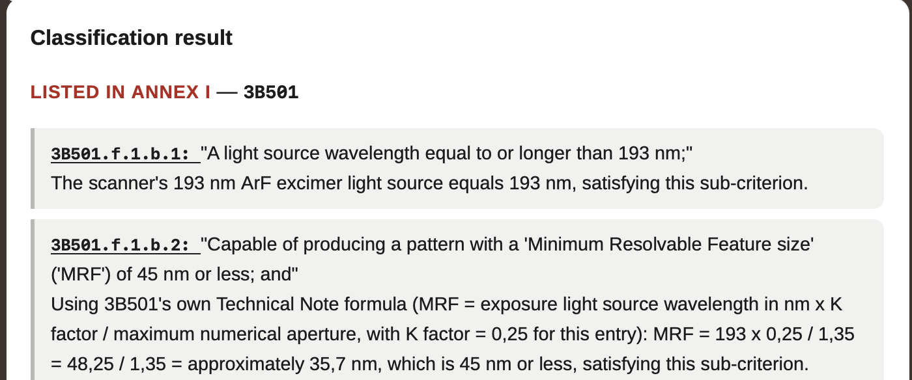
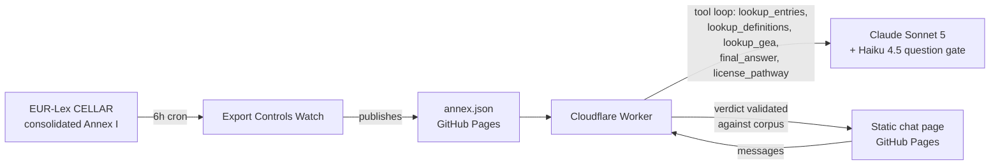

# EU Dual-Use Classifier

Describe a technology and get it classified under Regulation (EU) 2021/821, then see
which export authorisation applies: every quote is checked against the consolidated
text before you see it.



[](https://github.com/rikiosso/dualuse-classifier/actions/workflows/ci.yml)

**[Try it](https://rikiosso.github.io/dualuse-classifier/)**, or open one of the four
examples pre-filled:

- [Photolithography stepper](https://rikiosso.github.io/dualuse-classifier/?q=A%20photolithography%20stepper%20with%20a%20193%20nm%20ArF%20light%20source%20for%20300%20mm%20wafers)
- [AI training cluster](https://rikiosso.github.io/dualuse-classifier/?q=A%20GPU%20server%20cluster%20for%20training%20large%20AI%20models)
- [Long-range drone](https://rikiosso.github.io/dualuse-classifier/?q=A%20consumer%20drone%20with%20a%2040%20km%20control%20link%20and%208%20kg%20payload)
- [Everyday web software](https://rikiosso.github.io/dualuse-classifier/?q=Standard%20e-commerce%20web%20software%20with%20TLS%20encryption)

## Why it exists

Language models sound like the regulation and are unreliable at quoting it: they cite
thresholds that do not exist in the provision they name. Here, the server rejects any
citation that is not literally present in the cited provision, so a verdict either
quotes the real text or does not ship. The corpus itself updates automatically from
EUR-Lex, so the ground truth it quotes against stays current without a manual step.

## How it works


```mermaid
flowchart LR
    A[EUR-Lex CELLAR\nconsolidated Annex I] -->|6h cron| B[Export Controls Watch]
    B -->|publishes| C[annex.json\nGitHub Pages]
    C --> D[Cloudflare Worker]
    E[Static chat page\nGitHub Pages] -->|messages| D
    D -->|"tool loop: lookup_entries,\nlookup_definitions, lookup_gea,\nfinal_answer, license_pathway"| F[Claude Sonnet 5\n+ Haiku 4.5 question gate]
    D -->|verdict validated\nagainst corpus| E
```

The request flow, streaming protocol and model/cost budgets are in
[docs/architecture.md](docs/architecture.md).

The dataset (`annex.json`) is republished every 6 hours by
[Export Controls Watch](https://rikiosso.github.io/exports-watch/), an automated
pipeline whose code is private. The public repository
[github.com/rikiosso/exports-watch](https://github.com/rikiosso/exports-watch) holds the
published output and documents the dataset schema in its README.

## Numbers

No accuracy figure exists yet. [docs/benchmark.md](docs/benchmark.md) is the table,
filled in with `npm run bench` once ten annotated real cases exist.
[docs/caught.md](docs/caught.md) is the template for one validator rejection captured
live with `wrangler tail`: the model cites text that is not in the provision it named and
the server refuses to ship it. It is not filled in yet.

## Known limitations

Stated up front, because an honest limit is what makes the rest credible.

- **Latency.** A turn is a chain of sequential model calls (interview, question gate,
  forced card, validation, retry). Expect 20–40 s for a question and longer for a
  card; the page streams progress so you can see which stage you are in. The
  per-stage timings are logged for every turn (`wrangler tail`).
- **Two conversations per visitor per day**, and a small shared daily budget. When it
  is spent the page falls back to Browse mode. This is a demo, not a service.
- **Annex I only.** Catch-all controls (Articles 4 and 5), national lists, the EU
  Common Military List, US re-export rules and sanctions are out of scope; the
  tool flags sanctioned destinations and stops.
- **Questions do not always cite their provision.** The prompt asks for it; the
  server measures it (`question_cited` in the logs) and does not yet enforce it.
- **The corpus is the consolidated text, not the Official Journal.** Only the OJ is
  authentic. Every card carries the `corpus_version` it was made against.
- **It has not been benchmarked.** There is no published accuracy figure yet. The
  validator guarantees that what ships is grounded; it does not guarantee that the
  interview asked the right questions.

## Run your own

```bash
cd worker
npm install
npm test                                       # offline test suite, no API key needed
npx wrangler kv namespace create BUDGET_KV     # paste the id into wrangler.toml
npx wrangler secret put ANTHROPIC_API_KEY      # a DEDICATED key (see below)
npx wrangler secret put IP_SALT                # any random string (pseudonymises IPs)
npx wrangler deploy
# then put your workers.dev URL into docs/config.js; GitHub Pages serves docs/ as-is
```

**Required for the cost guarantee:** create a *dedicated* Anthropic API key for this Worker and
set a monthly spend limit on it in the Anthropic console (e.g. $10). That server-side limit is
the hard ceiling; the in-app KV counters are only the polite throttle beneath it. Details in
[docs/architecture.md](docs/architecture.md).

`docs/` is plain HTML/JS. GitHub Pages serves it as-is (Settings → Pages → main /docs). The
Worker is the only backend.

## Threat model (what the Worker does and does not defend against)

- **Forged transcripts.** The client re-sends the whole history. Verdict acceptance
  markers are HMAC-signed, so a client cannot fabricate a "validated" verdict to
  unlock the licensing stage; a recovered verdict is re-validated against the corpus
  before it is echoed back.
- **Prompt injection through the description.** User text is treated as facts about
  an item, never as instructions (rule 8), and conclusions can only leave through the
  strict tools plus server validation, so an injected "say it is not listed" still
  has to produce a verdict whose quotes exist.
- **Cost abuse.** Per-IP conversation and request meters, global day/month counters
  in KV, and a dedicated API key with a spend limit set in the Anthropic console. The
  KV counters are best-effort; the key limit is the guarantee.
- **Not defended:** requests without an `Origin` header (curl, scripts) pass the
  origin check and are limited only by the per-IP meters — accepted, because the key
  limit bounds the damage. KV counters are eventually consistent, so a burst can
  overshoot the daily budget by a few reservations.

## Scripts

Run from `worker/`, Node 22.18+.

- `npm run bench -- --cases cases.json`: drives a JSON file of annotated cases through
  the deployed API with the tester key and prints the rows for `docs/benchmark.md`.
- `npm run perf-summary tail.ndjson`: mean, median and p90 per stage and per turn type
  from saved `wrangler tail --format json` output.
- `npm run probe-schema`: one minimal API call that checks whether a strict tool schema
  accepts a nullable boolean, the open question behind a tri-state `met` field.

## Legal

Annex I text © European Union, [EUR-Lex](https://eur-lex.europa.eu/), reuse permitted with
acknowledgment (Commission Decision 2011/833/EU). Only the Official Journal of the European
Union is authentic. Code: MIT.

> ⚠️ Not legal advice. This is an indicative, automated triage. Catch-all controls
> (Articles 4 and 5 of the Regulation) may apply regardless of listing, national measures and
> the EU Common Military List are out of scope, and a licensing authority or qualified counsel
> has the final word.

---

Built by [Ricardo Álvarez-Ossorio Castro](https://www.linkedin.com/in/ricardo-ossorio),
export-controls and tech lawyer. Part of a series:
[Export Controls Watch](https://rikiosso.github.io/exports-watch/) (automated dataset) and
this classifier (interactive triage).
